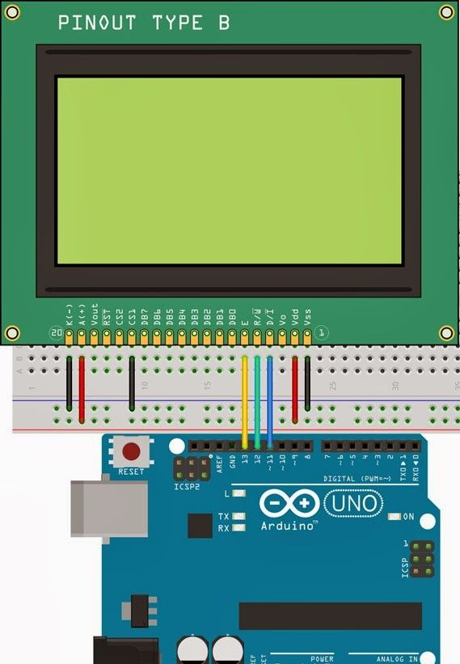

# Arduino-12864a-display
Arduino C++ muhitida quyida 128x64 grafik display uchun dasturiy vosita rivojlantirilgan. Bu haqda to'liq ma'lumot berib o'taman.

<a href=https://www.avrfreaks.net/projects/u8glib-and-u8g2>U8G2 va U8G kutubxonalari haqida</a>

Ko'p uchraydigan savol 12864a display arduinoda qanday ishlaydi?

