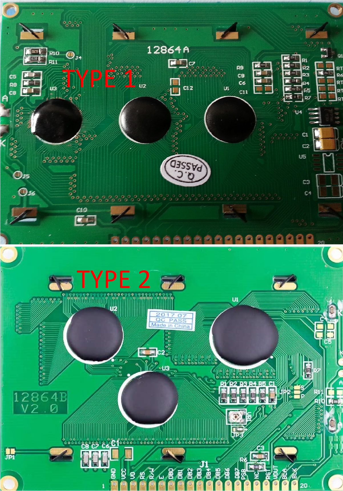
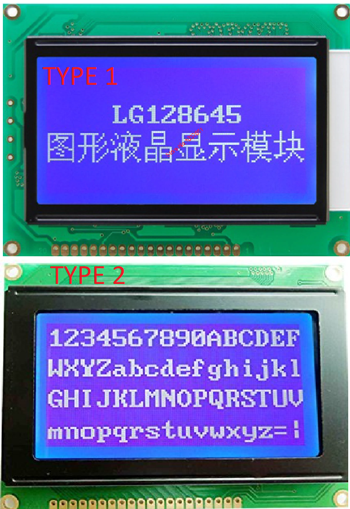
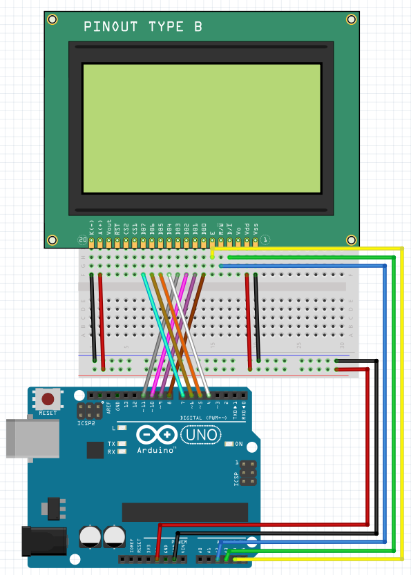

# Arduino-128x64-graphic-display
<i><h2>Arduino C++ muhitida quyida 128x64 grafik displey uchun dasturiy vosita rivojlantirilgan. </h2></i>Bu haqda to'liq ma'lumot berib o'taman.
<p><i><a href=https://www.avrfreaks.net/projects/u8glib-and-u8g2>U8G2 va U8G kutubxonalari.</a></i><p>
<h3>Foydalanishda quyidagilar bajariladi:</h3>
<ul>
  <li>Ulanish sxemasidan foydalanish</li>
  <li>Dasturdan foydalanish</li>
</ul>
Ko'p uchraydigan savol 12864a displey arduinoda qanday ishlaydi? 
<p>

<p>

<p>
Rasmda ko'rinishidan bir xil lekin, ishlash prinsipi 2 xil bo'lgan displey ko'rsatilgan.
<p>
  <ul>
    <li> Birinchi turdagi displey 128x64 o'lchamdagi KS0108.</li>
    <li> Ikkinchi turdagi displey 128x64 o'lchamdagi ST7920.</li>
  </ul>
Birinchi turdagi displey arxitektura jixatdan ancha eski hisoblanadi va <a href=https://hackprojects.wordpress.com/forum/avr/interfacing-ks0108-based-128x64-graphical-lcd-with-avr-microcontroller-atmega-8/>I/O port orqali sahifalardagi pixel qiymatlarini boshqarish</a> protokolini qo'llab quvvatlaydi ammo SPI (Serial Peripheral Interface) qo'llab bo'lmaydi.
Ikkinchi turdagi displey esa yangilangan versiya hisoblanadi va I/O port orqali hamda SPI orqali boshqarish imkoniyati mavjud.
<p>
<h2>Ulanish sxemasi:</h2>
<h3>Quyida 2 xil turdagi displeylarning ulanishi keltirilgan:</h3>
KS0108 displeyning Arduino Uno qurilmasiga ulanishi:

<p>
ST7920 displeyning Arduino Uno qurilmasiga ulanishi:
<p>

<p>
<h2>Dastur:</h2>
<h3>Dasturdan foydalanishda quyidagi o'zgartirishlar bajariladi:</h3>

#Arduino code
```cpp
#include <Arduino.h>
#include <ArduinoJson.h>
#include <TimerOne.h>

DynamicJsonDocument doc(1024);

// ***********************************************************************************************************
// ** Agar 1 - turdagi displeydan [KS0108] foydalanilsa U8GLIB_H oldidan {//} belgini olib tashlash         **
// ** aks holda 2 - turdagi displeydan [ST7920] foydalanilsa U8G2LIB_H oldidan [//] belgi olib tashlash     **
// ** kerak bo'ladi                                                                                         **
// ***********************************************************************************************************

//#define U8GLIB_H
//#define U8G2LIB_H

#ifdef U8X8_HAVE_HW_SPI
#include <SPI.h>
#endif
#ifdef U8X8_HAVE_HW_I2C
#include <Wire.h>
#endif
#ifdef U8G2LIB_H
#include <U8g2lib.h>
U8G2_ST7920_128X64_F_SW_SPI u8g2(U8G2_R0, /* clock=*/ 13, /* data=*/ 11, /* CS=*/ 10, /* reset=*/ 8);
#endif
#ifdef U8GLIB_H
#include <U8glib.h>
U8GLIB_KS0108_128 u8g(3, 4, 5, 6, 7, 8, 9, 10, 2, 11, 12, A2, A1); // 8Bit Com: DB0..DB7: 3,4,5,6,7,8,9,10, en=2, cs1=11, cs2=12,di=A2,rw=A1 || wiring 12864a display uchun
#endif
```
